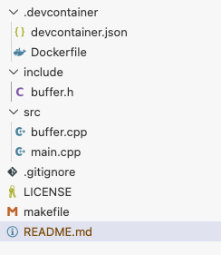

# Workshop Phase 0


## Steps

1. Create the repo in GitHub
   1. Name: hook2026
   2. Visibility: Public
   3. README.md: True
   4. License: MIT
2. Clone the Repo
3. Edit License to include your name in the (c) = ©
4. Create the file system structure with the following empty files

```
project-root/
│
├── .devcontainer/              # VS Code Dev Container configuration
│   ├── devcontainer.json       # Dev container settings
│   └── Dockerfile              # Container build instructions
│
├── include/                    # Header files
│   └── buffer.h
│
├── src/                        # Source files
│   ├── buffer.cpp
│   └── main.cpp
│
├── makefile                    # Build configuration
├── .gitignore                  # Git ignored files
├── README.md                   # Project documentation
└── LICENSE                     # License file


```

The following sequence of commands executed at the command line with the repo's directory achieves this structure:
```bash
mkdir -p .devcontainer include src
touch makefile include/buffer.h src/main.cpp src/buffer.cpp 
touch .devcontainer/Dockerfile .devcontainer/devcontainer.json
```

:pushpin: `TAG step-00-01-structure`

At the end it should look like this:



5. Write the following code on `.devcontainer/devcontainer.json`:
```json
{
  "name": "UNITEC C++ Workshop",
  "build": {
    "dockerfile": "Dockerfile"
  },
  "customizations": {
    "vscode": {
      "settings": {
        "terminal.integrated.defaultProfile.linux": "bash",
        "C_Cpp.default.compilerPath": "/usr/bin/g++"
      },
      "extensions": [
        "ms-vscode.cpptools",
        "ms-vscode.cmake-tools",
        "ms-azuretools.vscode-docker"
      ]
    }
  },
  "remoteUser": "vscode",
  "postCreateCommand": "make doctor || true"
}
```

6. Write the following code on `.devcontainer/Dockerfile`:
```dockerfile
FROM mcr.microsoft.com/devcontainers/base:ubuntu
# Why not ubuntu:latest? Because the devcontainer base image has some optimizations and tools pre-installed that are useful for development.

RUN apt-get update && apt-get install -y --no-install-recommends \
    build-essential \
    clang \
    gdb \
    llvm \
    libclang-rt-18-dev \
    valgrind \
    make \
    git \
    vim \
    curl \
    ca-certificates \
    && apt-get clean && rm -rf /var/lib/apt/lists/*

# Optional but nice: install GitHub CLI (gh)
RUN type -p curl >/dev/null || (apt-get update && apt-get install -y curl) \
 && curl -fsSL https://cli.github.com/packages/githubcli-archive-keyring.gpg \
    | dd of=/usr/share/keyrings/githubcli-archive-keyring.gpg \
 && chmod go+r /usr/share/keyrings/githubcli-archive-keyring.gpg \
 && echo "deb [arch=$(dpkg --print-architecture) signed-by=/usr/share/keyrings/githubcli-archive-keyring.gpg] https://cli.github.com/packages stable main" \
    > /etc/apt/sources.list.d/github-cli.list \
 && apt-get update \
 && apt-get install -y gh \
 && apt-get clean && rm -rf /var/lib/apt/lists/*
```

